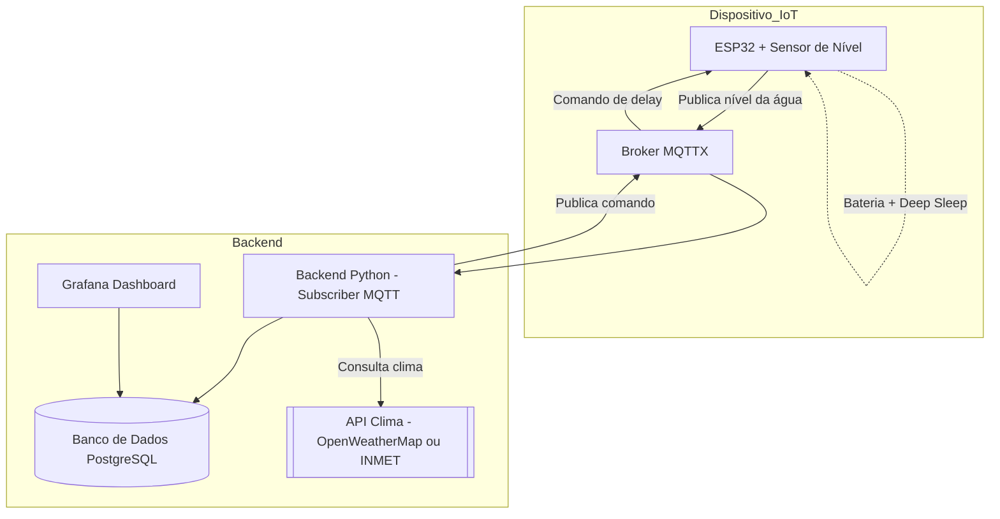

# Projeto: Monitoramento de Nível de Água com ESP32 e MQTT

- Christian Aguiar Plentz
- Gabriel de Freitas Adolfo
- Luís Dorr

## Hardware

- ⁠Placa ESP32 (IDE Arduino)
- ⁠Sensor: Módulo Sensor de Distância Ultrassônico HC-SR04

## Rede

- WIFI
- Topologia: Estrela

## Sensor App

- ⁠Arduino
  - ⁠Comunica com broker MQTT
  - ⁠Publica o nível da água
  - ⁠Assina um canal para regular seu delay de publicação

## Broker

- ⁠MQTTX

## Backend

- ⁠Python
  - ⁠Assina o canal de nível da água
  - ⁠Registra o nível da água no banco de dados
  - ⁠Quando o nível for maior que o definido em código: Alerta e registra o alerta no banco de dados
  - **⁠EXTRA:** Se comunica com API de previsão do tempo (OpenWeatherMap ou INMET API): Se estiver chovendo diminui o delay do sensor (maior frequência); Se estiver um dia ensolarado aumenta o delay do sensor (menor frequência/deep sleep);

## Banco de dados

- ⁠PostgreSQL

## Front

- Dashboards ⁠Grafana
  - Integrado com o banco de dados PostgreSQL
  - Exibe o nível da água em tempo real
  - Exibe alertas de nível crítico

## Arquitetura

## Bibliotecas

- ⁠ESP32:
  - ⁠PubSubClient (para MQTT)
  - ⁠WiFi (para conexão Wi-Fi)
- ⁠Python:
  - ⁠paho-mqtt (para MQTT)
  - ⁠psycopg2 (para PostgreSQL)
- ⁠Grafana:
  - ⁠Conexão com PostgreSQL (via plugin de banco de dados)
