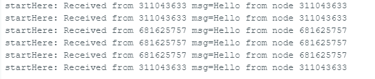
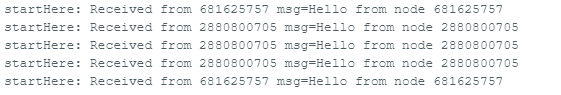
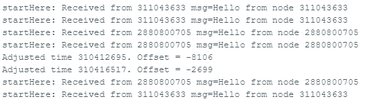
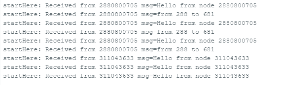

# IoT

## Atividade 3

### Grupo

- Christian Plentz
- Gabriel de Freitas
- Luís Dorr

### Proposta

Entrega da Implementação da Rede Wifi Mesh com ESP32

### Passo a Passo

[ESP-MESH](https://microcontrollerslab.com/esp-mesh-esp32-esp8266-painlessmesh-tutorial/): Getting Started using painlessMesh Library and ESP32/ESP8266

### Arduino IDE

- No serial monitor definir baud como 115200

#### Dependências

- Utilizar versão 3.0.7 da biblioteca ESP32
- Utilizar versão 3.4.2 da biblioteca Async TCP

### Resultados

#### Broadcast

[Código](./esp_mesh_broadcast.ino) utilizado para o Broadcast

```ino
void sendmsg() {
  String msg = "This is a testing message from Node1";
  msg += mesh.getNodeId();
  mesh.sendBroadcast(msg);
  taskSendmsg.setInterval(random(TASK_SECOND * 1, TASK_SECOND * 5));
}
```

##### Visão do Nodo 2880800705 - COM5



##### Visão do Nodo 311043633 - COM8



##### Visão do Nodo 681625757 - COM9



#### Mensagem especifica

[Código](./esp_mesh_single.ino) utilizado para a mensagem especifica

```ino
void sendmsg() {
  String msg = "This is a testing message from Node1";
  msg += mesh.getNodeId();
  mesh.sendBroadcast(msg);

  /**
   * Code built at nodeId 2880800705
   */
  mesh.sendSingle(681625757, "From 288 to 681.");

  taskSendmsg.setInterval(random(TASK_SECOND * 1, TASK_SECOND * 5));
}
```

##### Visão do Nodo 681625757 - COM9

O nodo 681625757 recebeu a mensagem do nodo 2880800705.



> Os outros nodos não receberam a mensagem.
